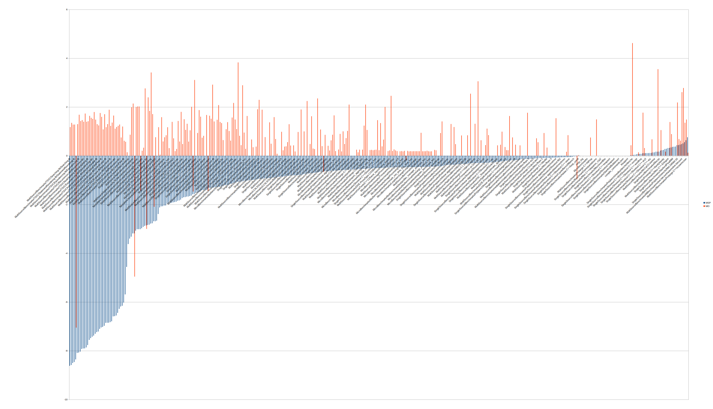

# List of Benchmarks in this file:
### SingleSource/Benchmarks & MultiSource, -Oz
```
- Base             vs. Machine Outliner
- Base             vs. MSP
- Machine Outliner vs. MSP running before Machine Outliner
- MSP              vs. MSP running before Machine Outliner
- Machine Outliner vs. MSP
```

### Big objects (19 large single files I could find), -Oz
```
- Base vs. MSP
```

### Meaningless SingleSource/Benchmarks & MultiSource, **RELEASE BUILD**
```
- Base vs. MSP
```

---

### SingleSource/Benchmarks & MultiSource, -Oz
#### Base vs. Machine Outliner
```
ts-compare-dirs "$TS_BASE" "$TS_MO" base mo
top 60 / bot 10 of programs:    342
base text:   12203647
mo text:   12330507
delta:       +126860 bytes (+1.040%)
  -11543  -1.435%  base=  804240 mo=  792697  MultiSource/Applications/kimwitu++/kc
    -957  -4.961%  base=   19290 mo=   18333  MultiSource/Benchmarks/MiBench/security-blowfish/security-blowfish
    -942  -1.470%  base=   64096 mo=   63154  SingleSource/Benchmarks/Adobe-C++/simple_types_loop_invariant
    -751  -0.968%  base=   77613 mo=   76862  SingleSource/Benchmarks/Adobe-C++/simple_types_constant_folding
    -173  -2.097%  base=    8250 mo=    8077  SingleSource/Benchmarks/Misc/flops
    -104  -3.004%  base=    3462 mo=    3358  SingleSource/Benchmarks/Polybench/stencils/heat-3d/heat-3d
     -56  -1.450%  base=    3863 mo=    3807  SingleSource/Benchmarks/Polybench/stencils/jacobi-2d/jacobi-2d
     -34  -0.197%  base=   17278 mo=   17244  SingleSource/Benchmarks/Adobe-C++/functionobjects
     -32  -0.669%  base=    4785 mo=    4753  MultiSource/Applications/viterbi/viterbi
      +0  +0.000%  base=    1259 mo=    1259  SingleSource/Benchmarks/Shootout/Shootout-hello
      +0  +0.000%  base=    1327 mo=    1327  SingleSource/Benchmarks/Misc/lowercase
      +0  +0.000%  base=    1376 mo=    1376  SingleSource/Benchmarks/Shootout/Shootout-nestedloop
      +0  +0.000%  base=    1447 mo=    1447  SingleSource/Benchmarks/Shootout/Shootout-sieve
      +0  +0.000%  base=    1458 mo=    1458  SingleSource/Benchmarks/Shootout/Shootout-fib2
      +0  +0.000%  base=    1461 mo=    1461  SingleSource/Benchmarks/Shootout/Shootout-random
      +0  +0.000%  base=    1486 mo=    1486  SingleSource/Benchmarks/Shootout/Shootout-ackermann
      +0  +0.000%  base=    1607 mo=    1607  SingleSource/Benchmarks/Misc/fp-convert
      +0  +0.000%  base=    1668 mo=    1668  SingleSource/Benchmarks/Shootout-C++/Shootout-C++-hello
      +0  +0.000%  base=    1675 mo=    1675  SingleSource/Benchmarks/Shootout/Shootout-ary3
      +0  +0.000%  base=    1722 mo=    1722  SingleSource/Benchmarks/Shootout-C++/Shootout-C++-nestedloop
      +0  +0.000%  base=    1726 mo=    1726  SingleSource/Benchmarks/Misc-C++/mandel-text
      +0  +0.000%  base=    1740 mo=    1740  SingleSource/Benchmarks/BenchmarkGame/nsieve-bits
      +0  +0.000%  base=    1794 mo=    1794  SingleSource/Benchmarks/Misc/revertBits
      +0  +0.000%  base=    1796 mo=    1796  SingleSource/Benchmarks/Misc/pi
      +0  +0.000%  base=    1826 mo=    1826  SingleSource/Benchmarks/Stanford/Bubblesort
      +0  +0.000%  base=    1851 mo=    1851  SingleSource/Benchmarks/Shootout-C++/Shootout-C++-fibo
      +0  +0.000%  base=    1859 mo=    1859  SingleSource/Benchmarks/Stanford/IntMM
      +0  +0.000%  base=    1867 mo=    1867  SingleSource/Benchmarks/BenchmarkGame/fannkuch
      +0  +0.000%  base=    1890 mo=    1890  SingleSource/Benchmarks/Misc/dt
      +0  +0.000%  base=    1890 mo=    1890  SingleSource/Benchmarks/Shootout/Shootout-heapsort
      +0  +0.000%  base=    1892 mo=    1892  SingleSource/Benchmarks/Shootout-C++/Shootout-C++-random
      +0  +0.000%  base=    1898 mo=    1898  SingleSource/Benchmarks/Stanford/RealMM
      +0  +0.000%  base=    1934 mo=    1934  MultiSource/Benchmarks/Prolangs-C++/NP/np
      +0  +0.000%  base=    1936 mo=    1936  SingleSource/Benchmarks/Stanford/FloatMM
      +0  +0.000%  base=    1961 mo=    1961  SingleSource/Benchmarks/Shootout-C++/Shootout-C++-sumcol
      +0  +0.000%  base=    1975 mo=    1975  SingleSource/Benchmarks/Stanford/Quicksort
      +0  +0.000%  base=    2019 mo=    2019  SingleSource/Benchmarks/Shootout-C++/Shootout-C++-ackermann
      +0  +0.000%  base=    2024 mo=    2024  SingleSource/Benchmarks/Shootout-C++/Shootout-C++-heapsort
      +0  +0.000%  base=    2036 mo=    2036  SingleSource/Benchmarks/Misc/flops-2
      +0  +0.000%  base=    2058 mo=    2058  SingleSource/Benchmarks/Misc/flops-1
      +0  +0.000%  base=    2061 mo=    2061  SingleSource/Benchmarks/Shootout/Shootout-strcat
      +0  +0.000%  base=    2079 mo=    2079  SingleSource/Benchmarks/Misc/flops-7
      +0  +0.000%  base=    2099 mo=    2099  SingleSource/Benchmarks/Stanford/Queens
      +0  +0.000%  base=    2102 mo=    2102  SingleSource/Benchmarks/Shootout/Shootout-methcall
      +0  +0.000%  base=    2124 mo=    2124  MultiSource/Benchmarks/Olden/treeadd/treeadd
      +0  +0.000%  base=    2165 mo=    2165  SingleSource/Benchmarks/Misc/flops-3
      +0  +0.000%  base=    2181 mo=    2181  SingleSource/Benchmarks/Shootout-C++/Shootout-C++-wc
      +0  +0.000%  base=    2201 mo=    2201  SingleSource/Benchmarks/BenchmarkGame/n-body
      +0  +0.000%  base=    2211 mo=    2211  SingleSource/Benchmarks/Stanford/Treesort
      +0  +0.000%  base=    2235 mo=    2235  SingleSource/Benchmarks/BenchmarkGame/spectral-norm
      +0  +0.000%  base=    2267 mo=    2267  SingleSource/Benchmarks/Misc/salsa20
      +0  +0.000%  base=    2273 mo=    2273  SingleSource/Benchmarks/Misc/flops-4
      +0  +0.000%  base=    2277 mo=    2277  SingleSource/Benchmarks/Shootout/Shootout-objinst
      +0  +0.000%  base=    2278 mo=    2278  SingleSource/Benchmarks/BenchmarkGame/puzzle
      +0  +0.000%  base=    2307 mo=    2307  SingleSource/Benchmarks/BenchmarkGame/recursive
      +0  +0.000%  base=    2337 mo=    2337  SingleSource/Benchmarks/Misc/flops-5
      +0  +0.000%  base=    2337 mo=    2337  SingleSource/Benchmarks/Misc/flops-6
      +0  +0.000%  base=    2356 mo=    2356  SingleSource/Benchmarks/Misc/flops-8
      +0  +0.000%  base=    2410 mo=    2410  MultiSource/Benchmarks/Prolangs-C++/primes/primes
      +0  +0.000%  base=    2425 mo=    2425  MultiSource/Benchmarks/Rodinia/pathfinder/pathfinder
   +4277  +2.005%  base=  213287 mo=  217564  MultiSource/Benchmarks/Prolangs-C/TimberWolfMC/timberwolfmc
   +5188  +3.826%  base=  135582 mo=  140770  MultiSource/Benchmarks/MallocBench/espresso/espresso
   +5868  +0.939%  base=  624816 mo=  630684  MultiSource/Benchmarks/Bullet/bullet
   +5920  +2.076%  base=  285115 mo=  291035  MultiSource/Benchmarks/mafft/pairlocalalign
   +7012  +1.474%  base=  475758 mo=  482770  MultiSource/Benchmarks/DOE-ProxyApps-C++/CLAMR/CLAMR
   +7152  +1.168%  base=  612243 mo=  619395  MultiSource/Applications/ClamAV/clamscan
   +7720  +0.972%  base=  793899 mo=  801619  MultiSource/Benchmarks/7zip/7zip-benchmark
   +8772  +1.517%  base=  578251 mo=  587023  MultiSource/Applications/JM/lencod/lencod
   +9487  +2.760%  base=  343712 mo=  353199  MultiSource/Applications/sqlite3/sqlite3
  +10336  +2.291%  base=  451091 mo=  461427  MultiSource/Applications/SPASS/SPASS
```

#### Base vs. MSP
```
ts-compare-dirs "$TS_BASE" "$TS_PARAM" base msp
top 60 / bot 10 of programs:    342
base text:   12203647
msp text:   11996924
delta:       -206723 bytes (-1.694%)
  -31127  -6.189%  base=  502979 msp=  471852  MultiSource/Benchmarks/MiBench/consumer-typeset/consumer-typeset
  -24242  -3.014%  base=  804240 msp=  779998  MultiSource/Applications/kimwitu++/kc
  -12056  -1.969%  base=  612243 msp=  600187  MultiSource/Applications/ClamAV/clamscan
   -9897  -2.879%  base=  343712 msp=  333815  MultiSource/Applications/sqlite3/sqlite3
   -7636  -1.321%  base=  578251 msp=  570615  MultiSource/Applications/JM/lencod/lencod
   -6328  -0.797%  base=  793899 msp=  787571  MultiSource/Benchmarks/7zip/7zip-benchmark
   -6122  -1.287%  base=  475758 msp=  469636  MultiSource/Benchmarks/DOE-ProxyApps-C++/CLAMR/CLAMR
   -4561  -3.077%  base=  148251 msp=  143690  MultiSource/Applications/lua/lua
   -4264  -0.945%  base=  451091 msp=  446827  MultiSource/Applications/SPASS/SPASS
   -3657  -1.283%  base=  285115 msp=  281458  MultiSource/Benchmarks/mafft/pairlocalalign
   -3495  -1.639%  base=  213287 msp=  209792  MultiSource/Benchmarks/Prolangs-C/TimberWolfMC/timberwolfmc
   -3264  -1.929%  base=  169200 msp=  165936  MultiSource/Benchmarks/MallocBench/gs/gs
   -3191  -1.200%  base=  265894 msp=  262703  MultiSource/Applications/JM/ldecod/ldecod
   -2898  -0.464%  base=  624816 msp=  621918  MultiSource/Benchmarks/Bullet/bullet
   -2561  -1.485%  base=  172434 msp=  169873  MultiSource/Benchmarks/ASCI_Purple/SMG2000/smg2000
   -2240  -1.699%  base=  131878 msp=  129638  MultiSource/Benchmarks/MiBench/consumer-lame/consumer-lame
   -2173  -2.844%  base=   76395 msp=   74222  MultiSource/Benchmarks/PAQ8p/paq8p
   -1760  -1.402%  base=  125496 msp=  123736  MultiSource/Benchmarks/mediabench/jpeg/jpeg-6a/cjpeg
   -1644  -0.592%  base=  277614 msp=  275970  MultiSource/Applications/oggenc/oggenc
   -1507  -1.314%  base=  114652 msp=  113145  MultiSource/Applications/treecc/treecc
   -1452  -1.071%  base=  135582 msp=  134130  MultiSource/Benchmarks/MallocBench/espresso/espresso
   -1389  -1.149%  base=  120933 msp=  119544  MultiSource/Benchmarks/MiBench/consumer-jpeg/consumer-jpeg
   -1240  -6.028%  base=   20572 msp=   19332  MultiSource/Benchmarks/TSVC/ControlFlow-flt/ControlFlow-flt
   -1204  -6.827%  base=   17635 msp=   16431  MultiSource/Benchmarks/TSVC/Reductions-flt/Reductions-flt
   -1196  -5.691%  base=   21015 msp=   19819  MultiSource/Benchmarks/TSVC/ControlFlow-dbl/ControlFlow-dbl
   -1192  -2.690%  base=   44310 msp=   43118  MultiSource/Benchmarks/DOE-ProxyApps-C/miniGMG/miniGMG
   -1178  -2.043%  base=   57669 msp=   56491  MultiSource/Benchmarks/MiBench/office-ispell/office-ispell
   -1173  -3.016%  base=   38895 msp=   37722  MultiSource/Applications/ALAC/decode/alacconvert-decode
   -1173  -3.016%  base=   38895 msp=   37722  MultiSource/Applications/ALAC/encode/alacconvert-encode
   -1153  -7.024%  base=   16415 msp=   15262  MultiSource/Benchmarks/TSVC/Expansion-flt/Expansion-flt
   -1139  -2.829%  base=   40260 msp=   39121  MultiSource/Benchmarks/Prolangs-C/simulator/simulator
   -1131  -6.857%  base=   16493 msp=   15362  MultiSource/Benchmarks/TSVC/ControlLoops-flt/ControlLoops-flt
   -1130  -6.283%  base=   17986 msp=   16856  MultiSource/Benchmarks/TSVC/Reductions-dbl/Reductions-dbl
   -1130  -8.077%  base=   13990 msp=   12860  MultiSource/Benchmarks/TSVC/Equivalencing-flt/Equivalencing-flt
   -1116  -8.588%  base=   12995 msp=   11879  MultiSource/Benchmarks/TSVC/Packing-flt/Packing-flt
   -1109  -7.046%  base=   15739 msp=   14630  MultiSource/Benchmarks/TSVC/GlobalDataFlow-flt/GlobalDataFlow-flt
   -1109  -7.215%  base=   15370 msp=   14261  MultiSource/Benchmarks/TSVC/LoopRestructuring-flt/LoopRestructuring-flt
   -1108  -6.556%  base=   16900 msp=   15792  MultiSource/Benchmarks/TSVC/LinearDependence-flt/LinearDependence-flt
   -1106  -8.507%  base=   13001 msp=   11895  MultiSource/Benchmarks/TSVC/Recurrences-flt/Recurrences-flt
   -1105  -6.583%  base=   16786 msp=   15681  MultiSource/Benchmarks/TSVC/Expansion-dbl/Expansion-dbl
   -1103  -7.239%  base=   15236 msp=   14133  MultiSource/Benchmarks/TSVC/InductionVariable-flt/InductionVariable-flt
   -1102  -7.906%  base=   13939 msp=   12837  MultiSource/Benchmarks/TSVC/Symbolics-flt/Symbolics-flt
   -1100  -8.464%  base=   12996 msp=   11896  MultiSource/Benchmarks/TSVC/StatementReordering-flt/StatementReordering-flt
   -1099  -7.770%  base=   14144 msp=   13045  MultiSource/Benchmarks/TSVC/NodeSplitting-flt/NodeSplitting-flt
   -1094  -8.620%  base=   12691 msp=   11597  MultiSource/Benchmarks/TSVC/Searching-flt/Searching-flt
   -1091  -8.038%  base=   13573 msp=   12482  MultiSource/Benchmarks/TSVC/LoopRerolling-flt/LoopRerolling-flt
   -1088  -6.448%  base=   16873 msp=   15785  MultiSource/Benchmarks/TSVC/ControlLoops-dbl/ControlLoops-dbl
   -1087  -7.557%  base=   14384 msp=   13297  MultiSource/Benchmarks/TSVC/IndirectAddressing-flt/IndirectAddressing-flt
   -1078  -6.854%  base=   15729 msp=   14651  MultiSource/Benchmarks/TSVC/LoopRestructuring-dbl/LoopRestructuring-dbl
   -1066  -7.426%  base=   14355 msp=   13289  MultiSource/Benchmarks/TSVC/Equivalencing-dbl/Equivalencing-dbl
   -1065  -6.157%  base=   17296 msp=   16231  MultiSource/Benchmarks/TSVC/LinearDependence-dbl/LinearDependence-dbl
   -1061  -6.592%  base=   16096 msp=   15035  MultiSource/Benchmarks/TSVC/GlobalDataFlow-dbl/GlobalDataFlow-dbl
   -1060  -6.795%  base=   15600 msp=   14540  MultiSource/Benchmarks/TSVC/InductionVariable-dbl/InductionVariable-dbl
   -1060  -7.304%  base=   14512 msp=   13452  MultiSource/Benchmarks/TSVC/NodeSplitting-dbl/NodeSplitting-dbl
   -1059  -7.105%  base=   14906 msp=   13847  MultiSource/Benchmarks/TSVC/CrossingThresholds-flt/CrossingThresholds-flt
   -1059  -7.930%  base=   13355 msp=   12296  MultiSource/Benchmarks/TSVC/Packing-dbl/Packing-dbl
   -1056  -7.909%  base=   13352 msp=   12296  MultiSource/Benchmarks/TSVC/Recurrences-dbl/Recurrences-dbl
   -1056  -8.092%  base=   13050 msp=   11994  MultiSource/Benchmarks/TSVC/Searching-dbl/Searching-dbl
   -1055  -7.381%  base=   14293 msp=   13238  MultiSource/Benchmarks/TSVC/Symbolics-dbl/Symbolics-dbl
   -1050  -7.867%  base=   13347 msp=   12297  MultiSource/Benchmarks/TSVC/StatementReordering-dbl/StatementReordering-dbl
     +23  +0.436%  base=    5272 msp=    5295  MultiSource/Benchmarks/Prolangs-C/fixoutput/fixoutput
     +24  +0.474%  base=    5064 msp=    5088  MultiSource/Benchmarks/MiBench/automotive-bitcount/automotive-bitcount
     +25  +0.104%  base=   24057 msp=   24082  SingleSource/Benchmarks/Misc-C++/stepanov_container
     +25  +0.454%  base=    5507 msp=    5532  MultiSource/Benchmarks/Prolangs-C++/trees/trees
     +40  +0.277%  base=   14451 msp=   14491  SingleSource/Benchmarks/Adobe-C++/stepanov_abstraction
     +46  +0.503%  base=    9145 msp=    9191  MultiSource/Benchmarks/Prolangs-C++/deriv2/deriv2
     +47  +0.634%  base=    7414 msp=    7461  MultiSource/Benchmarks/Prolangs-C++/ocean/ocean
     +64  +0.554%  base=   11542 msp=   11606  SingleSource/Benchmarks/Misc-C++/bigfib
    +147  +0.756%  base=   19447 msp=   19594  SingleSource/Benchmarks/Adobe-C++/stepanov_vector
    +658  +0.315%  base=  208817 msp=  209475  SingleSource/Benchmarks/Misc-C++-EH/spirit
```

#### Machine Outliner vs. MSP running before Machine Outliner
```
ts-compare-dirs "$TS_MO" "$TS_PARAM_MO" mo msp_mo
top 60 / bot 10 of programs:    342
mo text:   12330507
msp_mo text:   12173714
delta:       -156793 bytes (-1.272%)
  -21753  -4.293%  mo=  506741 msp_mo=  484988  MultiSource/Benchmarks/MiBench/consumer-typeset/consumer-typeset
  -11520  -1.860%  mo=  619395 msp_mo=  607875  MultiSource/Applications/ClamAV/clamscan
   -9397  -2.661%  mo=  353199 msp_mo=  343802  MultiSource/Applications/sqlite3/sqlite3
   -6624  -0.826%  mo=  801619 msp_mo=  794995  MultiSource/Benchmarks/7zip/7zip-benchmark
   -5948  -1.013%  mo=  587023 msp_mo=  581075  MultiSource/Applications/JM/lencod/lencod
   -4258  -0.537%  mo=  792697 msp_mo=  788439  MultiSource/Applications/kimwitu++/kc
   -4234  -0.877%  mo=  482770 msp_mo=  478536  MultiSource/Benchmarks/DOE-ProxyApps-C++/CLAMR/CLAMR
   -3917  -2.590%  mo=  151212 msp_mo=  147295  MultiSource/Applications/lua/lua
   -3776  -0.818%  mo=  461427 msp_mo=  457651  MultiSource/Applications/SPASS/SPASS
   -2992  -1.028%  mo=  291035 msp_mo=  288043  MultiSource/Benchmarks/mafft/pairlocalalign
   -2924  -1.704%  mo=  171548 msp_mo=  168624  MultiSource/Benchmarks/MallocBench/gs/gs
   -2645  -0.981%  mo=  269554 msp_mo=  266909  MultiSource/Applications/JM/ldecod/ldecod
   -2419  -1.112%  mo=  217564 msp_mo=  215145  MultiSource/Benchmarks/Prolangs-C/TimberWolfMC/timberwolfmc
   -2262  -0.359%  mo=  630684 msp_mo=  628422  MultiSource/Benchmarks/Bullet/bullet
   -1724  -1.351%  mo=  127592 msp_mo=  125868  MultiSource/Benchmarks/mediabench/jpeg/jpeg-6a/cjpeg
   -1704  -1.210%  mo=  140770 msp_mo=  139066  MultiSource/Benchmarks/MallocBench/espresso/espresso
   -1607  -2.054%  mo=   78223 msp_mo=   76616  MultiSource/Benchmarks/PAQ8p/paq8p
   -1604  -1.306%  mo=  122827 msp_mo=  121223  MultiSource/Benchmarks/MiBench/consumer-jpeg/consumer-jpeg
   -1581  -0.900%  mo=  175659 msp_mo=  174078  MultiSource/Benchmarks/ASCI_Purple/SMG2000/smg2000
   -1512  -1.134%  mo=  133278 msp_mo=  131766  MultiSource/Benchmarks/MiBench/consumer-lame/consumer-lame
   -1266  -0.452%  mo=  280386 msp_mo=  279120  MultiSource/Applications/oggenc/oggenc
   -1142  -1.964%  mo=   58153 msp_mo=   57011  MultiSource/Benchmarks/MiBench/office-ispell/office-ispell
   -1141  -2.876%  mo=   39680 msp_mo=   38539  MultiSource/Applications/ALAC/decode/alacconvert-decode
   -1141  -2.876%  mo=   39680 msp_mo=   38539  MultiSource/Applications/ALAC/encode/alacconvert-encode
   -1027  -6.277%  mo=   16361 msp_mo=   15334  MultiSource/Benchmarks/TSVC/GlobalDataFlow-dbl/GlobalDataFlow-dbl
   -1025  -4.850%  mo=   21135 msp_mo=   20110  MultiSource/Benchmarks/TSVC/ControlFlow-dbl/ControlFlow-dbl
   -1018  -5.588%  mo=   18216 msp_mo=   17198  MultiSource/Benchmarks/TSVC/Reductions-dbl/Reductions-dbl
   -1008  -5.902%  mo=   17080 msp_mo=   16072  MultiSource/Benchmarks/TSVC/ControlLoops-dbl/ControlLoops-dbl
   -1008  -5.939%  mo=   16972 msp_mo=   15964  MultiSource/Benchmarks/TSVC/Expansion-dbl/Expansion-dbl
   -1005  -5.742%  mo=   17503 msp_mo=   16498  MultiSource/Benchmarks/TSVC/LinearDependence-dbl/LinearDependence-dbl
   -1004  -6.817%  mo=   14727 msp_mo=   13723  MultiSource/Benchmarks/TSVC/NodeSplitting-dbl/NodeSplitting-dbl
    -997  -6.305%  mo=   15812 msp_mo=   14815  MultiSource/Benchmarks/TSVC/InductionVariable-dbl/InductionVariable-dbl
    -996  -6.835%  mo=   14572 msp_mo=   13576  MultiSource/Benchmarks/TSVC/Equivalencing-dbl/Equivalencing-dbl
    -996  -6.846%  mo=   14549 msp_mo=   13553  MultiSource/Benchmarks/TSVC/Symbolics-dbl/Symbolics-dbl
    -995  -2.427%  mo=   41000 msp_mo=   40005  MultiSource/Benchmarks/Prolangs-C/simulator/simulator
    -995  -7.018%  mo=   14177 msp_mo=   13182  MultiSource/Benchmarks/TSVC/LoopRerolling-dbl/LoopRerolling-dbl
    -995  -7.343%  mo=   13550 msp_mo=   12555  MultiSource/Benchmarks/TSVC/Packing-dbl/Packing-dbl
    -994  -7.519%  mo=   13219 msp_mo=   12225  MultiSource/Benchmarks/TSVC/Searching-dbl/Searching-dbl
    -993  -6.623%  mo=   14994 msp_mo=   14001  MultiSource/Benchmarks/TSVC/IndirectAddressing-dbl/IndirectAddressing-dbl
    -993  -7.338%  mo=   13533 msp_mo=   12540  MultiSource/Benchmarks/TSVC/StatementReordering-dbl/StatementReordering-dbl
    -992  -6.372%  mo=   15569 msp_mo=   14577  MultiSource/Benchmarks/TSVC/CrossingThresholds-dbl/CrossingThresholds-dbl
    -971  -7.172%  mo=   13538 msp_mo=   12567  MultiSource/Benchmarks/TSVC/Recurrences-dbl/Recurrences-dbl
    -968  -4.677%  mo=   20698 msp_mo=   19730  MultiSource/Benchmarks/TSVC/ControlFlow-flt/ControlFlow-flt
    -967  -6.069%  mo=   15933 msp_mo=   14966  MultiSource/Benchmarks/TSVC/LoopRestructuring-dbl/LoopRestructuring-dbl
    -961  -5.383%  mo=   17851 msp_mo=   16890  MultiSource/Benchmarks/TSVC/Reductions-flt/Reductions-flt
    -954  -5.966%  mo=   15990 msp_mo=   15036  MultiSource/Benchmarks/TSVC/GlobalDataFlow-flt/GlobalDataFlow-flt
    -946  -5.669%  mo=   16686 msp_mo=   15740  MultiSource/Benchmarks/TSVC/ControlLoops-flt/ControlLoops-flt
    -940  -5.665%  mo=   16592 msp_mo=   15652  MultiSource/Benchmarks/TSVC/Expansion-flt/Expansion-flt
    -937  -6.532%  mo=   14344 msp_mo=   13407  MultiSource/Benchmarks/TSVC/NodeSplitting-flt/NodeSplitting-flt
    -937  -6.587%  mo=   14225 msp_mo=   13288  MultiSource/Benchmarks/TSVC/Equivalencing-flt/Equivalencing-flt
    -934  -6.052%  mo=   15433 msp_mo=   14499  MultiSource/Benchmarks/TSVC/InductionVariable-flt/InductionVariable-flt
    -934  -6.389%  mo=   14619 msp_mo=   13685  MultiSource/Benchmarks/TSVC/IndirectAddressing-flt/IndirectAddressing-flt
    -933  -5.456%  mo=   17099 msp_mo=   16166  MultiSource/Benchmarks/TSVC/LinearDependence-flt/LinearDependence-flt
    -931  -7.069%  mo=   13170 msp_mo=   12239  MultiSource/Benchmarks/TSVC/Packing-flt/Packing-flt
    -930  -6.132%  mo=   15167 msp_mo=   14237  MultiSource/Benchmarks/TSVC/CrossingThresholds-flt/CrossingThresholds-flt
    -927  -6.537%  mo=   14180 msp_mo=   13253  MultiSource/Benchmarks/TSVC/Symbolics-flt/Symbolics-flt
    -927  -7.220%  mo=   12840 msp_mo=   11913  MultiSource/Benchmarks/TSVC/Searching-flt/Searching-flt
    -922  -7.005%  mo=   13162 msp_mo=   12240  MultiSource/Benchmarks/TSVC/StatementReordering-flt/StatementReordering-flt
    -916  -6.654%  mo=   13766 msp_mo=   12850  MultiSource/Benchmarks/TSVC/LoopRerolling-flt/LoopRerolling-flt
    -911  -5.854%  mo=   15561 msp_mo=   14650  MultiSource/Benchmarks/TSVC/LoopRestructuring-flt/LoopRestructuring-flt
      +8  +0.237%  mo=    3379 msp_mo=    3387  MultiSource/Benchmarks/Prolangs-C++/family/family
      +8  +0.287%  mo=    2790 msp_mo=    2798  SingleSource/Benchmarks/Misc/mandel
     +23  +0.415%  mo=    5541 msp_mo=    5564  MultiSource/Benchmarks/Prolangs-C++/trees/trees
     +28  +0.444%  mo=    6309 msp_mo=    6337  MultiSource/Benchmarks/Prolangs-C++/deriv1/deriv1
     +34  +0.291%  mo=   11698 msp_mo=   11732  SingleSource/Benchmarks/Misc-C++/bigfib
     +37  +0.492%  mo=    7524 msp_mo=    7561  MultiSource/Benchmarks/Prolangs-C++/ocean/ocean
     +40  +0.276%  mo=   14475 msp_mo=   14515  SingleSource/Benchmarks/Adobe-C++/stepanov_abstraction
     +44  +0.468%  mo=    9399 msp_mo=    9443  MultiSource/Benchmarks/Prolangs-C++/deriv2/deriv2
    +139  +0.714%  mo=   19471 msp_mo=   19610  SingleSource/Benchmarks/Adobe-C++/stepanov_vector
    +658  +0.315%  mo=  208817 msp_mo=  209475  SingleSource/Benchmarks/Misc-C++-EH/spirit
```

#### MSP vs. MSP running before Machine Outliner
```
ts-compare-dirs "$TS_PARAM" "$TS_PARAM_MO" msp msp_mo
top 60 / bot 10 of programs:    342
msp text:   11996924
msp_mo text:   12173714
delta:       +176790 bytes (+1.474%)
    -751  -0.968%  msp=   77599 msp_mo=   76848  SingleSource/Benchmarks/Adobe-C++/simple_types_constant_folding
    -512  -2.742%  msp=   18675 msp_mo=   18163  MultiSource/Benchmarks/MiBench/security-blowfish/security-blowfish
     -68  -0.108%  msp=   63081 msp_mo=   63013  SingleSource/Benchmarks/Adobe-C++/simple_types_loop_invariant
     -17  -0.446%  msp=    3809 msp_mo=    3792  SingleSource/Benchmarks/Polybench/stencils/jacobi-2d/jacobi-2d
     -17  -0.506%  msp=    3363 msp_mo=    3346  SingleSource/Benchmarks/Polybench/stencils/heat-3d/heat-3d
     -12  -0.210%  msp=    5720 msp_mo=    5708  MultiSource/Benchmarks/Olden/em3d/em3d
     -12  -0.252%  msp=    4754 msp_mo=    4742  MultiSource/Applications/viterbi/viterbi
      +0  +0.000%  msp=    1259 msp_mo=    1259  SingleSource/Benchmarks/Shootout/Shootout-hello
      +0  +0.000%  msp=    1327 msp_mo=    1327  SingleSource/Benchmarks/Misc/lowercase
      +0  +0.000%  msp=    1370 msp_mo=    1370  SingleSource/Benchmarks/Shootout/Shootout-nestedloop
      +0  +0.000%  msp=    1446 msp_mo=    1446  SingleSource/Benchmarks/Shootout/Shootout-sieve
      +0  +0.000%  msp=    1457 msp_mo=    1457  SingleSource/Benchmarks/Shootout/Shootout-fib2
      +0  +0.000%  msp=    1461 msp_mo=    1461  SingleSource/Benchmarks/Shootout/Shootout-random
      +0  +0.000%  msp=    1472 msp_mo=    1472  SingleSource/Benchmarks/Shootout/Shootout-ackermann
      +0  +0.000%  msp=    1601 msp_mo=    1601  SingleSource/Benchmarks/Misc/fp-convert
      +0  +0.000%  msp=    1668 msp_mo=    1668  SingleSource/Benchmarks/Shootout-C++/Shootout-C++-hello
      +0  +0.000%  msp=    1673 msp_mo=    1673  SingleSource/Benchmarks/Shootout/Shootout-ary3
      +0  +0.000%  msp=    1710 msp_mo=    1710  SingleSource/Benchmarks/Misc-C++/mandel-text
      +0  +0.000%  msp=    1716 msp_mo=    1716  SingleSource/Benchmarks/Shootout-C++/Shootout-C++-nestedloop
      +0  +0.000%  msp=    1726 msp_mo=    1726  SingleSource/Benchmarks/BenchmarkGame/nsieve-bits
      +0  +0.000%  msp=    1794 msp_mo=    1794  SingleSource/Benchmarks/Misc/revertBits
      +0  +0.000%  msp=    1799 msp_mo=    1799  SingleSource/Benchmarks/Misc/pi
      +0  +0.000%  msp=    1826 msp_mo=    1826  SingleSource/Benchmarks/Stanford/Bubblesort
      +0  +0.000%  msp=    1850 msp_mo=    1850  SingleSource/Benchmarks/Shootout-C++/Shootout-C++-fibo
      +0  +0.000%  msp=    1860 msp_mo=    1860  SingleSource/Benchmarks/BenchmarkGame/fannkuch
      +0  +0.000%  msp=    1866 msp_mo=    1866  SingleSource/Benchmarks/Stanford/IntMM
      +0  +0.000%  msp=    1890 msp_mo=    1890  SingleSource/Benchmarks/Shootout/Shootout-heapsort
      +0  +0.000%  msp=    1892 msp_mo=    1892  SingleSource/Benchmarks/Misc/dt
      +0  +0.000%  msp=    1892 msp_mo=    1892  SingleSource/Benchmarks/Shootout-C++/Shootout-C++-random
      +0  +0.000%  msp=    1905 msp_mo=    1905  SingleSource/Benchmarks/Stanford/RealMM
      +0  +0.000%  msp=    1934 msp_mo=    1934  MultiSource/Benchmarks/Prolangs-C++/NP/np
      +0  +0.000%  msp=    1943 msp_mo=    1943  SingleSource/Benchmarks/Stanford/FloatMM
      +0  +0.000%  msp=    1955 msp_mo=    1955  SingleSource/Benchmarks/Shootout-C++/Shootout-C++-sumcol
      +0  +0.000%  msp=    1963 msp_mo=    1963  SingleSource/Benchmarks/Stanford/Quicksort
      +0  +0.000%  msp=    2005 msp_mo=    2005  SingleSource/Benchmarks/Shootout-C++/Shootout-C++-ackermann
      +0  +0.000%  msp=    2024 msp_mo=    2024  SingleSource/Benchmarks/Shootout-C++/Shootout-C++-heapsort
      +0  +0.000%  msp=    2034 msp_mo=    2034  SingleSource/Benchmarks/Misc/flops-2
      +0  +0.000%  msp=    2055 msp_mo=    2055  SingleSource/Benchmarks/Shootout/Shootout-strcat
      +0  +0.000%  msp=    2056 msp_mo=    2056  SingleSource/Benchmarks/Misc/flops-1
      +0  +0.000%  msp=    2076 msp_mo=    2076  SingleSource/Benchmarks/Misc/flops-7
      +0  +0.000%  msp=    2078 msp_mo=    2078  SingleSource/Benchmarks/Stanford/Queens
      +0  +0.000%  msp=    2090 msp_mo=    2090  SingleSource/Benchmarks/Shootout/Shootout-methcall
      +0  +0.000%  msp=    2112 msp_mo=    2112  MultiSource/Benchmarks/Olden/treeadd/treeadd
      +0  +0.000%  msp=    2163 msp_mo=    2163  SingleSource/Benchmarks/Misc/flops-3
      +0  +0.000%  msp=    2175 msp_mo=    2175  SingleSource/Benchmarks/Shootout-C++/Shootout-C++-wc
      +0  +0.000%  msp=    2197 msp_mo=    2197  SingleSource/Benchmarks/BenchmarkGame/n-body
      +0  +0.000%  msp=    2205 msp_mo=    2205  SingleSource/Benchmarks/Stanford/Treesort
      +0  +0.000%  msp=    2235 msp_mo=    2235  SingleSource/Benchmarks/BenchmarkGame/spectral-norm
      +0  +0.000%  msp=    2245 msp_mo=    2245  SingleSource/Benchmarks/Shootout/Shootout-objinst
      +0  +0.000%  msp=    2266 msp_mo=    2266  SingleSource/Benchmarks/BenchmarkGame/puzzle
      +0  +0.000%  msp=    2267 msp_mo=    2267  SingleSource/Benchmarks/Misc/salsa20
      +0  +0.000%  msp=    2270 msp_mo=    2270  SingleSource/Benchmarks/Misc/flops-4
      +0  +0.000%  msp=    2279 msp_mo=    2279  SingleSource/Benchmarks/BenchmarkGame/recursive
      +0  +0.000%  msp=    2334 msp_mo=    2334  SingleSource/Benchmarks/Misc/flops-5
      +0  +0.000%  msp=    2334 msp_mo=    2334  SingleSource/Benchmarks/Misc/flops-6
      +0  +0.000%  msp=    2353 msp_mo=    2353  SingleSource/Benchmarks/Misc/flops-8
      +0  +0.000%  msp=    2402 msp_mo=    2402  MultiSource/Benchmarks/Prolangs-C++/primes/primes
      +0  +0.000%  msp=    2423 msp_mo=    2423  MultiSource/Benchmarks/Rodinia/pathfinder/pathfinder
      +0  +0.000%  msp=    2426 msp_mo=    2426  SingleSource/Benchmarks/Misc/matmul_f64_4x4
      +0  +0.000%  msp=    2472 msp_mo=    2472  SingleSource/Benchmarks/Stanford/Towers
   +6504  +1.046%  msp=  621918 msp_mo=  628422  MultiSource/Benchmarks/Bullet/bullet
   +6585  +2.340%  msp=  281458 msp_mo=  288043  MultiSource/Benchmarks/mafft/pairlocalalign
   +7424  +0.943%  msp=  787571 msp_mo=  794995  MultiSource/Benchmarks/7zip/7zip-benchmark
   +7688  +1.281%  msp=  600187 msp_mo=  607875  MultiSource/Applications/ClamAV/clamscan
   +8441  +1.082%  msp=  779998 msp_mo=  788439  MultiSource/Applications/kimwitu++/kc
   +8900  +1.895%  msp=  469636 msp_mo=  478536  MultiSource/Benchmarks/DOE-ProxyApps-C++/CLAMR/CLAMR
   +9987  +2.992%  msp=  333815 msp_mo=  343802  MultiSource/Applications/sqlite3/sqlite3
  +10460  +1.833%  msp=  570615 msp_mo=  581075  MultiSource/Applications/JM/lencod/lencod
  +10824  +2.422%  msp=  446827 msp_mo=  457651  MultiSource/Applications/SPASS/SPASS
  +13136  +2.784%  msp=  471852 msp_mo=  484988  MultiSource/Benchmarks/MiBench/consumer-typeset/consumer-typeset
```

#### Machine Outliner vs. MSP
```
ts-compare-dirs "$TS_MO" "$TS_PARAM" mo msp
top 60 / bot 10 of programs:    342
mo text:   12330507
msp text:   11996924
delta:       -333583 bytes (-2.705%)
  -34889  -6.885%  mo=  506741 msp=  471852  MultiSource/Benchmarks/MiBench/consumer-typeset/consumer-typeset
  -19384  -5.488%  mo=  353199 msp=  333815  MultiSource/Applications/sqlite3/sqlite3
  -19208  -3.101%  mo=  619395 msp=  600187  MultiSource/Applications/ClamAV/clamscan
  -16408  -2.795%  mo=  587023 msp=  570615  MultiSource/Applications/JM/lencod/lencod
  -14600  -3.164%  mo=  461427 msp=  446827  MultiSource/Applications/SPASS/SPASS
  -14048  -1.752%  mo=  801619 msp=  787571  MultiSource/Benchmarks/7zip/7zip-benchmark
  -13134  -2.721%  mo=  482770 msp=  469636  MultiSource/Benchmarks/DOE-ProxyApps-C++/CLAMR/CLAMR
  -12699  -1.602%  mo=  792697 msp=  779998  MultiSource/Applications/kimwitu++/kc
   -9577  -3.291%  mo=  291035 msp=  281458  MultiSource/Benchmarks/mafft/pairlocalalign
   -8766  -1.390%  mo=  630684 msp=  621918  MultiSource/Benchmarks/Bullet/bullet
   -7772  -3.572%  mo=  217564 msp=  209792  MultiSource/Benchmarks/Prolangs-C/TimberWolfMC/timberwolfmc
   -7522  -4.974%  mo=  151212 msp=  143690  MultiSource/Applications/lua/lua
   -6851  -2.542%  mo=  269554 msp=  262703  MultiSource/Applications/JM/ldecod/ldecod
   -6640  -4.717%  mo=  140770 msp=  134130  MultiSource/Benchmarks/MallocBench/espresso/espresso
   -5786  -3.294%  mo=  175659 msp=  169873  MultiSource/Benchmarks/ASCI_Purple/SMG2000/smg2000
   -5612  -3.271%  mo=  171548 msp=  165936  MultiSource/Benchmarks/MallocBench/gs/gs
   -4848  -4.109%  mo=  117993 msp=  113145  MultiSource/Applications/treecc/treecc
   -4416  -1.575%  mo=  280386 msp=  275970  MultiSource/Applications/oggenc/oggenc
   -4001  -5.115%  mo=   78223 msp=   74222  MultiSource/Benchmarks/PAQ8p/paq8p
   -3856  -3.022%  mo=  127592 msp=  123736  MultiSource/Benchmarks/mediabench/jpeg/jpeg-6a/cjpeg
   -3640  -2.731%  mo=  133278 msp=  129638  MultiSource/Benchmarks/MiBench/consumer-lame/consumer-lame
   -3283  -2.673%  mo=  122827 msp=  119544  MultiSource/Benchmarks/MiBench/consumer-jpeg/consumer-jpeg
   -3116  -2.819%  mo=  110554 msp=  107438  MultiSource/Applications/siod/siod
   -2508  -1.209%  mo=  207458 msp=  204950  MultiSource/Applications/d/make_dparser
   -2208  -0.424%  mo=  521014 msp=  518806  MultiSource/Benchmarks/tramp3d-v4/tramp3d-v4
   -1958  -4.934%  mo=   39680 msp=   37722  MultiSource/Applications/ALAC/decode/alacconvert-decode
   -1958  -4.934%  mo=   39680 msp=   37722  MultiSource/Applications/ALAC/encode/alacconvert-encode
   -1879  -4.583%  mo=   41000 msp=   39121  MultiSource/Benchmarks/Prolangs-C/simulator/simulator
   -1662  -2.858%  mo=   58153 msp=   56491  MultiSource/Benchmarks/MiBench/office-ispell/office-ispell
   -1532  -3.219%  mo=   47589 msp=   46057  MultiSource/Applications/lemon/lemon
   -1528  -3.422%  mo=   44646 msp=   43118  MultiSource/Benchmarks/DOE-ProxyApps-C/miniGMG/miniGMG
   -1501  -2.553%  mo=   58791 msp=   57290  MultiSource/Applications/Burg/burg
   -1498  -3.226%  mo=   46436 msp=   44938  MultiSource/Benchmarks/mediabench/mpeg2/mpeg2dec/mpeg2decode
   -1472  -4.406%  mo=   33409 msp=   31937  MultiSource/Applications/obsequi/Obsequi
   -1438  -3.155%  mo=   45578 msp=   44140  MultiSource/Applications/hbd/hbd
   -1420  -7.955%  mo=   17851 msp=   16431  MultiSource/Benchmarks/TSVC/Reductions-flt/Reductions-flt
   -1366  -6.600%  mo=   20698 msp=   19332  MultiSource/Benchmarks/TSVC/ControlFlow-flt/ControlFlow-flt
   -1365  -9.596%  mo=   14225 msp=   12860  MultiSource/Benchmarks/TSVC/Equivalencing-flt/Equivalencing-flt
   -1360  -7.466%  mo=   18216 msp=   16856  MultiSource/Benchmarks/TSVC/Reductions-dbl/Reductions-dbl
   -1360  -8.505%  mo=   15990 msp=   14630  MultiSource/Benchmarks/TSVC/GlobalDataFlow-flt/GlobalDataFlow-flt
   -1343  -9.471%  mo=   14180 msp=   12837  MultiSource/Benchmarks/TSVC/Symbolics-flt/Symbolics-flt
   -1335  -8.575%  mo=   15569 msp=   14234  MultiSource/Benchmarks/TSVC/CrossingThresholds-dbl/CrossingThresholds-dbl
   -1330  -8.016%  mo=   16592 msp=   15262  MultiSource/Benchmarks/TSVC/Expansion-flt/Expansion-flt
   -1326  -8.105%  mo=   16361 msp=   15035  MultiSource/Benchmarks/TSVC/GlobalDataFlow-dbl/GlobalDataFlow-dbl
   -1324  -7.935%  mo=   16686 msp=   15362  MultiSource/Benchmarks/TSVC/ControlLoops-flt/ControlLoops-flt
   -1322  -3.602%  mo=   36697 msp=   35375  MultiSource/Benchmarks/Prolangs-C/football/football
   -1322  -9.043%  mo=   14619 msp=   13297  MultiSource/Benchmarks/TSVC/IndirectAddressing-flt/IndirectAddressing-flt
   -1320  -8.703%  mo=   15167 msp=   13847  MultiSource/Benchmarks/TSVC/CrossingThresholds-flt/CrossingThresholds-flt
   -1316  -6.227%  mo=   21135 msp=   19819  MultiSource/Benchmarks/TSVC/ControlFlow-dbl/ControlFlow-dbl
   -1311  -9.011%  mo=   14549 msp=   13238  MultiSource/Benchmarks/TSVC/Symbolics-dbl/Symbolics-dbl
   -1310  -2.617%  mo=   50054 msp=   48744  MultiSource/Benchmarks/mediabench/gsm/toast/toast
   -1307  -7.644%  mo=   17099 msp=   15792  MultiSource/Benchmarks/TSVC/LinearDependence-flt/LinearDependence-flt
   -1300  -8.354%  mo=   15561 msp=   14261  MultiSource/Benchmarks/TSVC/LoopRestructuring-flt/LoopRestructuring-flt
   -1300  -8.424%  mo=   15433 msp=   14133  MultiSource/Benchmarks/TSVC/InductionVariable-flt/InductionVariable-flt
   -1299  -9.056%  mo=   14344 msp=   13045  MultiSource/Benchmarks/TSVC/NodeSplitting-flt/NodeSplitting-flt
   -1295  -7.582%  mo=   17080 msp=   15785  MultiSource/Benchmarks/TSVC/ControlLoops-dbl/ControlLoops-dbl
   -1291  -7.607%  mo=   16972 msp=   15681  MultiSource/Benchmarks/TSVC/Expansion-dbl/Expansion-dbl
   -1291  -9.803%  mo=   13170 msp=   11879  MultiSource/Benchmarks/TSVC/Packing-flt/Packing-flt
   -1290  -2.577%  mo=   50062 msp=   48772  MultiSource/Benchmarks/MiBench/telecomm-gsm/telecomm-gsm
   -1284  -9.327%  mo=   13766 msp=   12482  MultiSource/Benchmarks/TSVC/LoopRerolling-flt/LoopRerolling-flt
      +7  +0.369%  mo=    1898 msp=    1905  SingleSource/Benchmarks/Stanford/RealMM
      +7  +0.377%  mo=    1859 msp=    1866  SingleSource/Benchmarks/Stanford/IntMM
      +8  +0.225%  mo=    3558 msp=    3566  MultiSource/Benchmarks/Prolangs-C++/simul/simul
      +8  +0.237%  mo=    3379 msp=    3387  MultiSource/Benchmarks/Prolangs-C++/family/family
      +8  +0.287%  mo=    2790 msp=    2798  SingleSource/Benchmarks/Misc/mandel
     +16  +0.111%  mo=   14475 msp=   14491  SingleSource/Benchmarks/Adobe-C++/stepanov_abstraction
    +123  +0.632%  mo=   19471 msp=   19594  SingleSource/Benchmarks/Adobe-C++/stepanov_vector
    +342  +1.865%  mo=   18333 msp=   18675  MultiSource/Benchmarks/MiBench/security-blowfish/security-blowfish
    +658  +0.315%  mo=  208817 msp=  209475  SingleSource/Benchmarks/Misc-C++-EH/spirit
    +737  +0.959%  mo=   76862 msp=   77599  SingleSource/Benchmarks/Adobe-C++/simple_types_constant_folding
```

---

### Build commands for above test:
```
ts-base
ts-mo
ts-param
ts-param-mo
```

### Compare commands for above test:
#### Base vs. Machine Outliner
```
ts-compare-dirs "$TS_BASE" "$TS_MO" base mo
```

#### Base vs. MSP
```
ts-compare-dirs "$TS_BASE" "$TS_PARAM" base msp
```

#### Machine Outliner vs. MSP running before Machine Outliner
```
ts-compare-dirs "$TS_MO" "$TS_PARAM_MO" mo msp_mo
```

#### MSP vs. MSP running before Machine Outliner
```
ts-compare-dirs "$TS_PARAM" "$TS_PARAM_MO" msp msp_mo
```

#### Machine Outliner vs. MSP
```
ts-compare-dirs "$TS_MO" "$TS_PARAM" mo msp
```

### Definitions of those commands:
## Build commands:
```
ts-base() {
  rm -rf "$TS_BASE" && mkdir "$TS_BASE" && cd "$TS_BASE" &&
  cmake -G Ninja \
    -DCMAKE_C_COMPILER="$LLVM_BUILD/bin/clang" \
    -DCMAKE_CXX_COMPILER="$LLVM_BUILD/bin/clang++" \
    -C "$TS_SRC/cmake/caches/Oz.cmake" \
    -DTEST_SUITE_SUBDIRS="SingleSource/Benchmarks;MultiSource" \
    "$TS_SRC" &&
  ninja -j"$(nproc)"
}

ts-mo() {
  rm -rf "$TS_MO" && mkdir "$TS_MO" && cd "$TS_MO" &&
  cmake -G Ninja \
    -DCMAKE_C_COMPILER="$LLVM_BUILD/bin/clang" \
    -DCMAKE_CXX_COMPILER="$LLVM_BUILD/bin/clang++" \
    -C "$TS_SRC/cmake/caches/Oz.cmake" \
    -DTEST_SUITE_SUBDIRS="SingleSource/Benchmarks;MultiSource" \
    -DCMAKE_C_FLAGS="-mllvm -enable-machine-outliner" \
    -DCMAKE_CXX_FLAGS="-mllvm -enable-machine-outliner" \
    "$TS_SRC" &&
  ninja -j"$(nproc)"
}

ts-param() {
  rm -rf "$TS_PARAM" && mkdir "$TS_PARAM" && cd "$TS_PARAM" &&
  cmake -G Ninja \
    -DCMAKE_C_COMPILER="$LLVM_BUILD/bin/clang" \
    -DCMAKE_CXX_COMPILER="$LLVM_BUILD/bin/clang++" \
    -C "$TS_SRC/cmake/caches/Oz.cmake" \
    -DTEST_SUITE_SUBDIRS="SingleSource/Benchmarks;MultiSource" \
    -DCMAKE_C_FLAGS="-mllvm -enable-machine-seq-param -mllvm -machine-seq-param-min-savings=8 -mllvm -machine-seq-param-align-penalty=8 -mllvm -x86-disable-movimmsexti8-push-pop -mllvm -enable-machine-seq-param-callsite-classifier" \
    -DCMAKE_CXX_FLAGS="-mllvm -enable-machine-seq-param -mllvm -machine-seq-param-min-savings=8 -mllvm -machine-seq-param-align-penalty=8 -mllvm -x86-disable-movimmsexti8-push-pop -mllvm -enable-machine-seq-param-callsite-classifier" \
    "$TS_SRC" &&
  ninja -j"$(nproc)"
}

ts-param-mo() {
  rm -rf "$TS_PARAM_MO" && mkdir "$TS_PARAM_MO" && cd "$TS_PARAM_MO" &&
  cmake -G Ninja \
    -DCMAKE_C_COMPILER="$LLVM_BUILD/bin/clang" \
    -DCMAKE_CXX_COMPILER="$LLVM_BUILD/bin/clang++" \
    -C "$TS_SRC/cmake/caches/Oz.cmake" \
    -DTEST_SUITE_SUBDIRS="SingleSource/Benchmarks;MultiSource" \
    -DCMAKE_C_FLAGS="-mllvm -enable-machine-seq-param -mllvm -machine-seq-param-min-savings=8 -mllvm -machine-seq-param-align-penalty=8 -mllvm -x86-disable-movimmsexti8-push-pop -mllvm -enable-machine-seq-param-callsite-classifier -mllvm -enable-machine-outliner" \
    -DCMAKE_CXX_FLAGS="-mllvm -enable-machine-seq-param -mllvm -machine-seq-param-min-savings=8 -mllvm -machine-seq-param-align-penalty=8 -mllvm -x86-disable-movimmsexti8-push-pop -mllvm -enable-machine-seq-param-callsite-classifier -mllvm -enable-machine-outliner" \
    "$TS_SRC" &&
  ninja -j"$(nproc)"
}
```

## Compare commands:
```
ts-sizes-one() {
  local dir="$1"
  cd "$dir" || return

  find SingleSource MultiSource -type f -perm -111 -print0 |
  while IFS= read -r -d '' f; do
    if file -b "$f" | grep -q '^ELF'; then
      "$LLVM_BUILD/bin/llvm-size" "$f" |
        awk -v file="$f" 'NR==2 && $1 != 0 { print file "\t" $1 }'
    fi
  done | LC_ALL=C sort
}

ts-compare-dirs() {
  local a="$1"
  local b="$2"
  local aname="${3:-a}"
  local bname="${4:-b}"
  local out="/tmp/$aname-$bname-size-diff.txt"
  local summary="/tmp/$aname-$bname-size-summary.txt"

  ts-sizes-one "$a" > /tmp/a-text.tsv
  ts-sizes-one "$b" > /tmp/b-text.tsv

  LC_ALL=C join -t $'\t' /tmp/a-text.tsv /tmp/b-text.tsv |
  awk -F'\t' -v aname="$aname" -v bname="$bname" -v summary="$summary" '
    {
      av = $2 + 0;
      bv = $3 + 0;
      if (av <= 0) next;

      d = bv - av;
      pct = 100.0 * d / av;

      total_a += av;
      total_b += bv;
      n++;

      printf "%+8d %+7.3f%%  %s=%8d %s=%8d  %s\n",
             d, pct, aname, av, bname, bv, $1;
    }

    END {
      d = total_b - total_a;
      pct = (total_a == 0 ? 0 : 100.0*d/total_a);

      printf "top 60 / bot 10 of programs:    %d\n", n > summary;
      printf "%s text:   %d\n", aname, total_a >> summary;
      printf "%s text:   %d\n", bname, total_b >> summary;
      printf "delta:       %+d bytes (%+.3f%%)\n", d, pct >> summary;
    }
  ' | sort -k1,1n > "$out"

  cat "$summary"
  echo
  head -60 "$out"
  tail -10 "$out"
}
```

---

### Big objects (19 large single files I could find), -Oz
#### Base vs. MSP
```
objects:     19
base text:   11408102
param text:  11121745
delta:       -286357 bytes (-2.510%)
  -62860  -4.012%  base= 1566696 param= 1503836  tools/clang/lib/Sema/CMakeFiles/obj.clangSema.dir/SemaExpr.cpp.o
  -53588  -2.461%  base= 2177552 param= 2123964  lib/Target/X86/CMakeFiles/LLVMX86CodeGen.dir/X86ISelLowering.cpp.o
  -27730  -3.488%  base=  794972 param=  767242  tools/clang/lib/AST/CMakeFiles/obj.clangAST.dir/ASTContext.cpp.o
  -27478  -4.111%  base=  668445 param=  640967  tools/clang/lib/CodeGen/CMakeFiles/obj.clangCodeGen.dir/CodeGenModule.cpp.o
  -17346  -2.378%  base=  729571 param=  712225  tools/clang/lib/Sema/CMakeFiles/obj.clangSema.dir/SemaTemplate.cpp.o
  -15548  -2.099%  base=  740847 param=  725299  tools/clang/lib/Sema/CMakeFiles/obj.clangSema.dir/SemaDecl.cpp.o
  -14481  -2.218%  base=  652900 param=  638419  lib/CodeGen/SelectionDAG/CMakeFiles/LLVMSelectionDAG.dir/SelectionDAG.cpp.o
  -13824  -2.693%  base=  513392 param=  499568  tools/clang/lib/Sema/CMakeFiles/obj.clangSema.dir/SemaChecking.cpp.o
   -7963  -1.657%  base=  480654 param=  472691  tools/clang/lib/Sema/CMakeFiles/obj.clangSema.dir/SemaOverload.cpp.o
   -7098  -3.753%  base=  189124 param=  182026  lib/CodeGen/CMakeFiles/LLVMCodeGen.dir/MachineVerifier.cpp.o
   -6957  -1.915%  base=  363371 param=  356414  tools/clang/lib/CodeGen/CMakeFiles/obj.clangCodeGen.dir/CGExpr.cpp.o
   -6366  -2.154%  base=  295574 param=  289208  tools/clang/lib/Sema/CMakeFiles/obj.clangSema.dir/SemaInit.cpp.o
   -5653  -2.770%  base=  204092 param=  198439  tools/clang/lib/AST/CMakeFiles/obj.clangAST.dir/Type.cpp.o
   -4738  -1.997%  base=  237203 param=  232465  lib/CodeGen/SelectionDAG/CMakeFiles/LLVMSelectionDAG.dir/LegalizeDAG.cpp.o
   -3200  -1.104%  base=  289750 param=  286550  tools/clang/lib/CodeGen/CMakeFiles/obj.clangCodeGen.dir/CGCall.cpp.o
   -3060  -1.062%  base=  288194 param=  285134  lib/Target/X86/CMakeFiles/LLVMX86CodeGen.dir/X86InstrInfo.cpp.o
   -2960  -0.358%  base=  826739 param=  823779  lib/Target/X86/CMakeFiles/LLVMX86CodeGen.dir/X86ISelDAGToDAG.cpp.o
   -2929  -1.463%  base=  200257 param=  197328  tools/clang/lib/AST/CMakeFiles/obj.clangAST.dir/Expr.cpp.o
   -2578  -1.366%  base=  188769 param=  186191  tools/clang/lib/AST/CMakeFiles/obj.clangAST.dir/Decl.cpp.o
```

---

### Meaningless SingleSource/Benchmarks & MultiSource, **RELEASE BUILD**
```
ts-compare-dirs "$TS_BASE" "$TS_PARAM" base msp
top 60 / bot 10 of programs:    342
base text:   20358615
msp text:   19500593
delta:       -858022 bytes (-4.215%)
  -29956  -3.399%  base=  881414 msp=  851458  MultiSource/Applications/kimwitu++/kc
  -28884  -3.420%  base=  844493 msp=  815609  MultiSource/Benchmarks/DOE-ProxyApps-C++/CLAMR/CLAMR
  -22050  -2.456%  base=  897791 msp=  875741  MultiSource/Applications/JM/lencod/lencod
  -18483 -16.255%  base=  113707 msp=   95224  MultiSource/Benchmarks/TSVC/ControlFlow-dbl/ControlFlow-dbl
  -18153 -16.605%  base=  109325 msp=   91172  MultiSource/Benchmarks/TSVC/LinearDependence-dbl/LinearDependence-dbl
  -18150 -16.781%  base=  108160 msp=   90010  MultiSource/Benchmarks/TSVC/ControlLoops-dbl/ControlLoops-dbl
  -18139 -16.801%  base=  107961 msp=   89822  MultiSource/Benchmarks/TSVC/Expansion-dbl/Expansion-dbl
  -18036 -16.833%  base=  107148 msp=   89112  MultiSource/Benchmarks/TSVC/LoopRestructuring-dbl/LoopRestructuring-dbl
  -18033 -17.232%  base=  104650 msp=   86617  MultiSource/Benchmarks/TSVC/NodeSplitting-dbl/NodeSplitting-dbl
  -17890 -16.359%  base=  109359 msp=   91469  MultiSource/Benchmarks/TSVC/Reductions-dbl/Reductions-dbl
  -17847 -16.883%  base=  105710 msp=   87863  MultiSource/Benchmarks/TSVC/CrossingThresholds-dbl/CrossingThresholds-dbl
  -17842 -17.340%  base=  102896 msp=   85054  MultiSource/Benchmarks/TSVC/StatementReordering-dbl/StatementReordering-dbl
  -17825 -16.909%  base=  105420 msp=   87595  MultiSource/Benchmarks/TSVC/IndirectAddressing-dbl/IndirectAddressing-dbl
  -17818 -17.006%  base=  104777 msp=   86959  MultiSource/Benchmarks/TSVC/Symbolics-dbl/Symbolics-dbl
  -17806 -16.788%  base=  106067 msp=   88261  MultiSource/Benchmarks/TSVC/InductionVariable-dbl/InductionVariable-dbl
  -17804 -16.935%  base=  105134 msp=   87330  MultiSource/Benchmarks/TSVC/Equivalencing-dbl/Equivalencing-dbl
  -17757 -16.520%  base=  107485 msp=   89728  MultiSource/Benchmarks/TSVC/GlobalDataFlow-dbl/GlobalDataFlow-dbl
  -17738 -17.242%  base=  102879 msp=   85141  MultiSource/Benchmarks/TSVC/Packing-dbl/Packing-dbl
  -17738 -17.242%  base=  102879 msp=   85141  MultiSource/Benchmarks/TSVC/Recurrences-dbl/Recurrences-dbl
  -17731 -17.112%  base=  103619 msp=   85888  MultiSource/Benchmarks/TSVC/LoopRerolling-dbl/LoopRerolling-dbl
  -17723 -17.267%  base=  102642 msp=   84919  MultiSource/Benchmarks/TSVC/Searching-dbl/Searching-dbl
  -15954  -3.132%  base=  509340 msp=  493386  MultiSource/Benchmarks/mafft/pairlocalalign
  -15655  -2.842%  base=  550749 msp=  535094  MultiSource/Benchmarks/MiBench/consumer-typeset/consumer-typeset
  -13880  -1.767%  base=  785423 msp=  771543  MultiSource/Applications/ClamAV/clamscan
  -13245 -16.293%  base=   81293 msp=   68048  MultiSource/Benchmarks/TSVC/ControlFlow-flt/ControlFlow-flt
  -13199 -17.450%  base=   75637 msp=   62438  MultiSource/Benchmarks/TSVC/ControlLoops-flt/ControlLoops-flt
  -13128 -16.983%  base=   77300 msp=   64172  MultiSource/Benchmarks/TSVC/LinearDependence-flt/LinearDependence-flt
  -13082 -17.290%  base=   75664 msp=   62582  MultiSource/Benchmarks/TSVC/Expansion-flt/Expansion-flt
  -12944 -17.894%  base=   72337 msp=   59393  MultiSource/Benchmarks/TSVC/NodeSplitting-flt/NodeSplitting-flt
  -12928 -17.165%  base=   75318 msp=   62390  MultiSource/Benchmarks/TSVC/GlobalDataFlow-flt/GlobalDataFlow-flt
  -12872  -1.993%  base=  645699 msp=  632827  MultiSource/Applications/SPASS/SPASS
  -12867 -17.212%  base=   74755 msp=   61888  MultiSource/Benchmarks/TSVC/LoopRestructuring-flt/LoopRestructuring-flt
  -12813 -17.337%  base=   73906 msp=   61093  MultiSource/Benchmarks/TSVC/InductionVariable-flt/InductionVariable-flt
  -12806 -17.501%  base=   73173 msp=   60367  MultiSource/Benchmarks/TSVC/CrossingThresholds-flt/CrossingThresholds-flt
  -12793 -17.682%  base=   72352 msp=   59559  MultiSource/Benchmarks/TSVC/Symbolics-flt/Symbolics-flt
  -12783 -17.581%  base=   72710 msp=   59927  MultiSource/Benchmarks/TSVC/IndirectAddressing-flt/IndirectAddressing-flt
  -12769 -16.645%  base=   76714 msp=   63945  MultiSource/Benchmarks/TSVC/Reductions-flt/Reductions-flt
  -12737 -18.091%  base=   70407 msp=   57670  MultiSource/Benchmarks/TSVC/StatementReordering-flt/StatementReordering-flt
  -12695 -17.502%  base=   72533 msp=   59838  MultiSource/Benchmarks/TSVC/Equivalencing-flt/Equivalencing-flt
  -12659 -17.721%  base=   71435 msp=   58776  MultiSource/Benchmarks/TSVC/LoopRerolling-flt/LoopRerolling-flt
  -12650 -18.024%  base=   70185 msp=   57535  MultiSource/Benchmarks/TSVC/Searching-flt/Searching-flt
  -12649 -17.958%  base=   70438 msp=   57789  MultiSource/Benchmarks/TSVC/Recurrences-flt/Recurrences-flt
  -12649 -17.962%  base=   70422 msp=   57773  MultiSource/Benchmarks/TSVC/Packing-flt/Packing-flt
  -11876  -1.269%  base=  935588 msp=  923712  MultiSource/Benchmarks/Bullet/bullet
  -11709  -2.010%  base=  582498 msp=  570789  MultiSource/Applications/sqlite3/sqlite3
   -9544  -2.028%  base=  470599 msp=  461055  MultiSource/Applications/oggenc/oggenc
   -9232  -0.741%  base= 1245319 msp= 1236087  MultiSource/Benchmarks/7zip/7zip-benchmark
   -8052  -0.842%  base=  955806 msp=  947754  MultiSource/Benchmarks/tramp3d-v4/tramp3d-v4
   -7454  -1.943%  base=  383729 msp=  376275  MultiSource/Applications/JM/ldecod/ldecod
   -7320  -3.346%  base=  218781 msp=  211461  MultiSource/Benchmarks/MiBench/consumer-lame/consumer-lame
   -5703  -6.237%  base=   91441 msp=   85738  MultiSource/Benchmarks/FreeBench/pifft/pifft
   -5392  -2.688%  base=  200613 msp=  195221  MultiSource/Benchmarks/mediabench/jpeg/jpeg-6a/cjpeg
   -5381  -2.754%  base=  195400 msp=  190019  MultiSource/Benchmarks/MiBench/consumer-jpeg/consumer-jpeg
   -4084  -3.096%  base=  131932 msp=  127848  MultiSource/Benchmarks/DOE-ProxyApps-C++/PENNANT/PENNANT
   -3933  -2.081%  base=  189041 msp=  185108  MultiSource/Applications/lua/lua
   -3512 -10.817%  base=   32468 msp=   28956  MultiSource/Benchmarks/Prolangs-C/gnugo/gnugo
   -3452  -4.930%  base=   70014 msp=   66562  MultiSource/Benchmarks/mediabench/gsm/toast/toast
   -3448  -4.925%  base=   70012 msp=   66564  MultiSource/Benchmarks/MiBench/telecomm-gsm/telecomm-gsm
   -3216  -1.167%  base=  275642 msp=  272426  MultiSource/Benchmarks/Prolangs-C/TimberWolfMC/timberwolfmc
   -2352 -13.175%  base=   17852 msp=   15500  MultiSource/Benchmarks/SciMark2-C/scimark2
     +26  +0.683%  base=    3804 msp=    3830  SingleSource/Benchmarks/BenchmarkGame/puzzle
     +28  +0.121%  base=   23205 msp=   23233  SingleSource/Benchmarks/Misc-C++/stepanov_container
     +28  +0.270%  base=   10367 msp=   10395  SingleSource/Benchmarks/Shootout-C++/Shootout-C++-hash2
     +30  +1.117%  base=    2685 msp=    2715  SingleSource/Benchmarks/BenchmarkGame/partialsums
     +32  +0.009%  base=  360747 msp=  360779  SingleSource/Benchmarks/Adobe-C++/loop_unroll
     +34  +0.610%  base=    5571 msp=    5605  SingleSource/Benchmarks/Shootout/Shootout-matrix
     +35  +0.091%  base=   38572 msp=   38607  MultiSource/Benchmarks/Prolangs-C/cdecl/cdecl
     +48  +0.578%  base=    8307 msp=    8355  SingleSource/Benchmarks/Misc-C++/Large/ray
     +49  +0.713%  base=    6868 msp=    6917  MultiSource/Benchmarks/DOE-ProxyApps-C++/HACCKernels/HACCKernels
    +160  +2.430%  base=    6584 msp=    6744  MultiSource/Benchmarks/Prolangs-C++/garage/garage
```

---

### Build commands for above test (compare cmd same as prev):
```
ts-base-release() {
  rm -rf "$TS_BASE" && mkdir "$TS_BASE" && cd "$TS_BASE" &&
  cmake -G Ninja \
    -DCMAKE_C_COMPILER="$LLVM_BUILD/bin/clang" \
    -DCMAKE_CXX_COMPILER="$LLVM_BUILD/bin/clang++" \
    -DCMAKE_BUILD_TYPE=Release \
    -DTEST_SUITE_SUBDIRS="SingleSource/Benchmarks;MultiSource" \
    "$TS_SRC" &&
  ninja -j"$(nproc)"
}

ts-param-release() {
  rm -rf "$TS_PARAM" && mkdir "$TS_PARAM" && cd "$TS_PARAM" &&
  cmake -G Ninja \
    -DCMAKE_C_COMPILER="$LLVM_BUILD/bin/clang" \
    -DCMAKE_CXX_COMPILER="$LLVM_BUILD/bin/clang++" \
    -DCMAKE_BUILD_TYPE=Release \
    -DTEST_SUITE_SUBDIRS="SingleSource/Benchmarks;MultiSource" \
    -DCMAKE_C_FLAGS="-mllvm -enable-machine-seq-param -mllvm -machine-seq-param-min-savings=12 -mllvm -machine-seq-param-align-penalty=8 -mllvm -x86-disable-movimmsexti8-push-pop -mllvm -enable-machine-seq-param-callsite-classifier" \
    -DCMAKE_CXX_FLAGS="-mllvm -enable-machine-seq-param -mllvm -machine-seq-param-min-savings=12 -mllvm -machine-seq-param-align-penalty=8 -mllvm -x86-disable-movimmsexti8-push-pop -mllvm -enable-machine-seq-param-callsite-classifier" \
    "$TS_SRC" &&
  ninja -j"$(nproc)"
}
```

